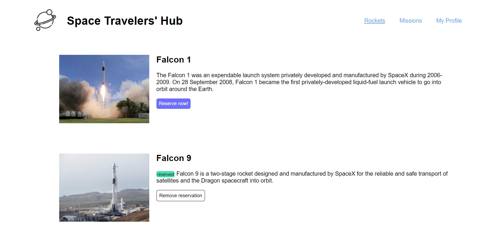
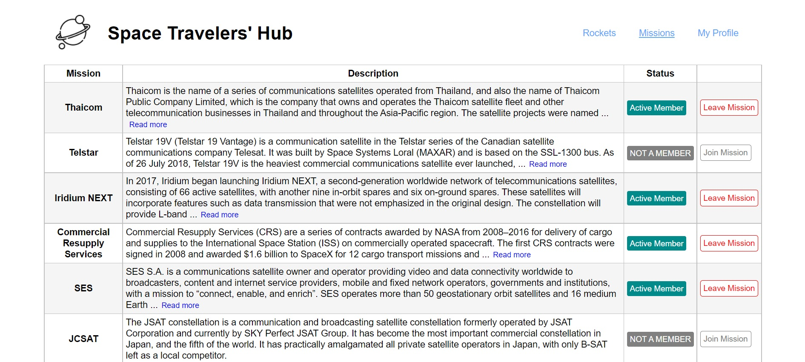
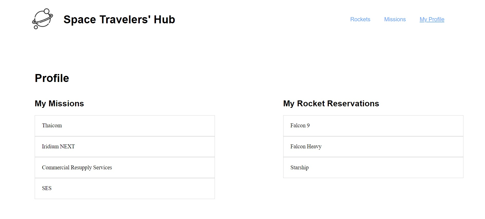

# Space Traveller
React & Redux group capstone project. This project is done on module 3, week 4 of the Microverse full-stack development program.

# Requirements for this project

Please find the requirements for this project [here](https://github.com/microverseinc/curriculum-react-redux/blob/main/group-project/project_space_travelers_hub.md).

# screenshot 
Rockets Page

Missions Page

Profile Page

## Technologies

- HTML
- CSS & SASS
- JS (ES6)
- React
- Redux
- JEST & React testing library

## Live Demo
You can find the live demo on [Netlify](https://endearing-griffin-06eddd.netlify.app/). 

## Authors

👤 **Franklin Benjamin**

- GitHub: [https://github.com/franklinben23](https://github.com/franklinben23)
- LinkedIn: [https://www.linkedin.com/in/franklinbenjamin/](https://www.linkedin.com/in/franklinbenjamin/)

👤 **Behnam Aghaali**

- GitHub: [https://github.com/Behnam1369](https://github.com/Behnam1369)
- LinkedIn: [https://www.linkedin.com/in/behnam-aghaali](https://www.linkedin.com/in/behnam-aghaali)
- Twitter: [https://twitter.com/behnamagh1369](https://twitter.com/behnamagh1369)
- Email: [behnam.aghaali@yahoo.com](mailto:behnam.aghaali@yahoo.com)

## 🤝 Contributing

Contributions, issues, and feature requests are welcome!

Feel free to check the [issues page](../../issues/).

## Show your support

Give a ⭐️ if you like this project!

## Acknowledgments

- Hat tip to anyone whose code was used
- Inspiration
- etc

## 📝 License

This project is [MIT](LICENSE) licensed.
